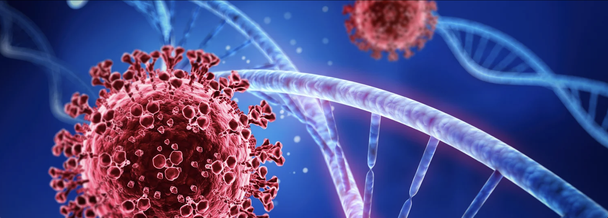

# Building a Predictive Model of COVID-19 Vaccinations

## Background
Vaccinating a large percentage of the community is an essential portion of the response to the COVID-19 pandemic. 
Three years from the vaccine roll-out, we  now have a more complete picture of the disparity in vaccination rates among certain populations. One area of concern is the effect of partisan alignment on vaccination hesitance, especially in an increasingly polarized political sphere. The extensive discourse regarding medical misinformation and demographic-specific institutional distrust highlights a crucial area of research: what determines the likelihood of vaccination? 

Examples of media covering this topic:
- (Kaiser Family Foundation: The Red-Blue Divide in COVID-19 Vaccination Rates Update)[https://www.kff.org/policy-watch/the-red-blue-divide-in-covid-19-vaccination-rates-continues-an-update/]
- (NPR: There's A Stark Red-Blue Divide When It Comes To States' Vaccination Rates)[https://www.npr.org/2021/06/09/1004430257/theres-a-stark-red-blue-divide-when-it-comes-to-states-vaccination-rates]

## Research Question
While we are inspired by and will pay particular attention to party-specific differences in vaccination rates, we have gathered data on a multitude of factors that might affect vaccination rates, in order to build a more robust model. 
Our research question is this: What factors best predict the rate of vaccination on a county-by-county level? 
The stakeholders here are numerous: the federal government wants to direct its efforts to the appropriate counties; local governments want to make sure they have necessary resources; businesses want to ensure healthy employees and customers; the public benefits from lower rates of disease and mortality.

## Data Understanding
We began with six datasets total, all providing data at the county-level. These datasets are provided below and in our data folder. 
Our target variable is the latest (as of May 2023) available cumulative data on completed primary series vaccinations by county, from the CDC. 
Our predictors are county-level demographic data: metro (urban) status from the same CDC dataset; 2020 Presidential election results from a github repository; race and age from the Census; poverty, median household income, and educational attainment from the USDA Economic Research Service. 
- [CDC: COVID-19 Vaccinations by County](https://data.cdc.gov/Vaccinations/COVID-19-Vaccinations-in-the-United-States-County/8xkx-amqh/about_data) (468.8MB)
- [Census Datasets](https://www.census.gov/data/tables/time-series/demo/popest/2020s-counties-detail.html)
- [USDA Datasets](https://www.ers.usda.gov/data-products/county-level-data-sets/)
- [County-Level Election Results](https://github.com/tonmcg/US_County_Level_Election_Results_08-20)

## Data Preparation
We compiled our six datasets into one cleaned dataset (again provided in our data folder) containing 3,113 rows -- one for almost every county in the US. We dropped data from Alaska because it administers its presidential elections by districts. These were drawn differently from its counties, so the mismatch between the datasets resulted in significant missing information across the board. We also dropped data from Puerto Rico, Guam, and the Virgin Islands, because no data was available for them in our predictors datasets.
We prepped our variables of interest in the following ways:
- Target (Vaccinations): We created a binary column where a county was assigned 1 if they had achieved a 70% primary series vaccination rate. This 70% threshold is based on (Johns Hopkins University's estimate)[https://coronavirus.jhu.edu/from-our-experts/early-herd-immunity-against-covid-19-a-dangerous-misconception#:~:text=To%20reach%20herd%20immunity%20for,before%20we%20reach%20this%20threshold.] of the percentage of the population that would need to be vaccinated in order to achieve herd immunity.
- **13** Predictors: Each is included because (1) data was available at the county level, and (2) because they potentially have an affect on the likelihood of whether someone got vaccinated.
  - 2020 Political Party Result: We kept two columns, one for the percentage of people in a county that voted for the Republican candidate, and one for the percentage of people in a county that voted for the Democratic candidate. We created a third column as the difference between the two -- "third party" voters.
  - Urban status: A binary column for whether the county was considered a "metro" area. To see whether rural areas had more difficulty accessing vaccines.
  - Poverty: A column containing the percentage of the population who were defined as "in poverty". This is one proxy measure for socioeconomic status.
  - Household Income: In dollars, the median household income in that county. This is a another proxy measure for socioeconomic status.
  - Race: We created four columns based on percentages of four major racial categories in each county: white, black, indigenous, and AAPI.
  - Age: A column for median age in said county.
  - Education: Two columns: one for those who had achieve anything at or below a high school diploma, another for some college and up.

## Modelling
We attempted five different types of predictive models in order to maximize our precision and accuracy scores. The former is the metric we are most concerned with, because it measures true positives: when the model predicted a 1 (herd immunity achieved), what percent of the time was it right? Increasing precision means reducing false positives. Since the public health goal is to have achieved herd immunity, increasing precision is paramount.
1. fsd
2. 2. 

## Results
When it predicted that full vaccination was achieved, it was right 71% of the time


## Impact
Public health efforts need to be informed by accurate data on heterogenous vaccination results so that providers can shape outreach to maximize positive outcomes. Having a predictive model for vaccination level can inform how we respond to future diseases. When we know what characteristics make vaccination less likely, we can changing the shape of our vaccine outreach in order to increase vaccination rates.
For example, if being Republican makes a person less likely to get vaccinated, we need to cater the media dialogue surrounding safety and efficacy to that group. Furthermore, based on the racial disparity in vaccination rates, achieving healthcare equity may require focusing manpower, medical supplies, etc. on the more vulnerable populations. 
Therefore, this model can change how medical public relations is done, who medical providers and the government targets, logistical realities of medical infrastructure, and more.
Ultimately this model can contribute to an ongoing debate about healthcare and race, wealth, and importantly political affiliation - the very question that sparked our interest in this research.

## Next Steps
There is exciting potential for further research should more county-level demographic data become available. Inputting other potential predictors of vaccinations could bring the precision and accuracy of our model higher up. Finding weak/less predictive data would also be informative.  
Other factors we were interested in, but did not find data for include:
- Vaccine access, which could be represented through measures of medical provider densities in each county. Locations of hospitals, CVS's and other pharmacies, number of doctors, etc. 
- Death rates are available per state, but not by county ([Johns Hopkins Interactive Map](https://coronavirus.jhu.edu/us-map)). They could help us ask whether more deaths led to higher vaccination.
- Unemployment data could help us answer whether higher unemployment meant more time for people to get vaccinated and fewer infections due to less interaction.
- Surveys and metrics measuring social and cultural attitudes toward medical institutions.

Data that was available but not included in this iteration of our model:
- CDC vaccination statuses by age could help us see differences in vaccination statuses between the different generations. Were younger people more likely to be vaccinated?
- The CDC also provided a Social Vulnerability Index.
  
## Repo Structure
```
├── data
│   ├── cleaned_data.csv
│   ├── COVID-19_Vaccinations_in_the_United_States_Jurisdiction_20240103
│   ├── cc-est2022-agesex-all.csv
│   ├── cc-est2022-all
│   ├── Education.xlsx
│   ├── PovertyEstimates.xlsx
│   ├── COVID-19_Vaccinations_by_County.csv
│   ├── 2020_US_County_Level_Presidential_Results.csv
├── Images
│   ├── readme_header.png
│   ├── pair_plot.png
├── Notebooks
│   ├── adjusted_target_and_other_variables.ipynb
│   ├── data_cleaning_scratch.ipynb
│   ├── modelling_scratch.ipynb
│   ├── nate_models_scratch.ipynb
│   ├── __pycache__
│   ├── nate_scratch.ipynb
│   ├── shelley_scratch.ipynb
├── presentation.pdf
├── .gitignore
├── Final.ipynb
├── LICENSE
├── README.md
```
